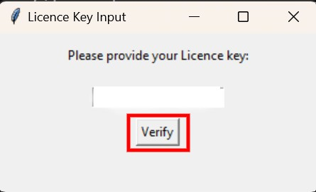

# 🔑 Licence Key

To get your access key, go to the [Whop Hub](https://www.whop.com/hub/).&#x20;


A Licence Key must be formatted like this:

```
EASYVOCBETA-XXXXXXX-XXXXXXXX-XXXXXXX
```

After you copied your Licence key, you go to the app.\
After you opened the app, you will be prompted to provide your Licence Key.

<figure><figcaption></figcaption></figure>

Fill in your Licence Key and press "Verify"
