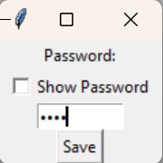

# 🆔 Pincode


A pincode must meet these requirements:

* 4 didgits long
* Numbers only


<figure><figcaption></figcaption></figure>

Your pincode is safely saved in the `auth.txt` file. We made sure nobody can read it.



`0000`



`9af15b336e6a9619928537df30b2e6a2376569fcf9d7e773eccede65606529a0`


