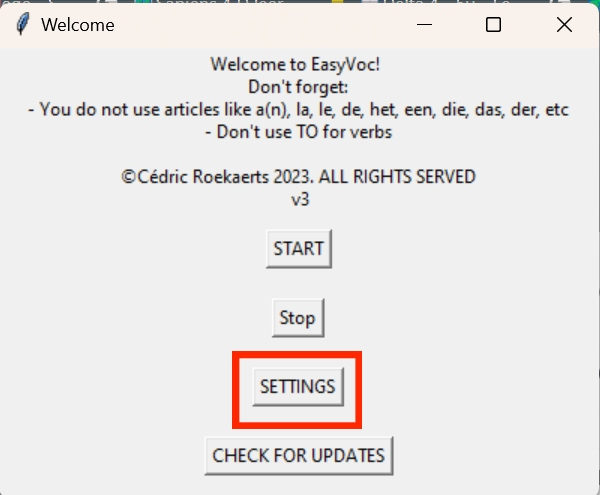

# Settings

You can change some settings in the app:

* Auto check for updates
* Give a hint

You can access the settings menu at the home screen:

<figure><figcaption></figcaption></figure>

At the settingscreen, you will see 2 checkboxes and a red button.

<figure><figcaption></figcaption></figure>

If Automatic update check is enabled, the app will automaticly look if there is an update availible.\
\
if Give tip is enabled, the app will give you a tip when you made a mistake.


DELETE LICENCE KEY only deletes the Key from your device and **not** on Whop!

